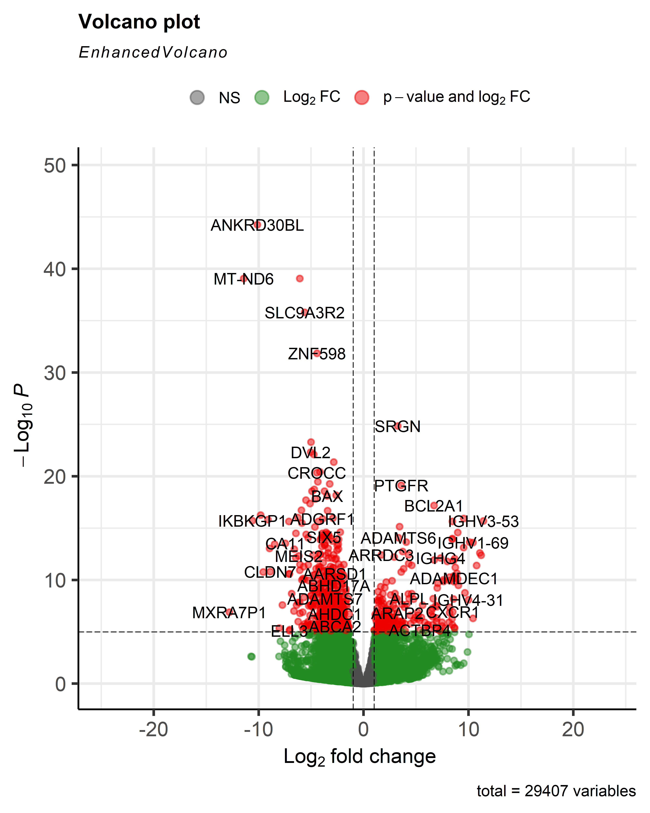
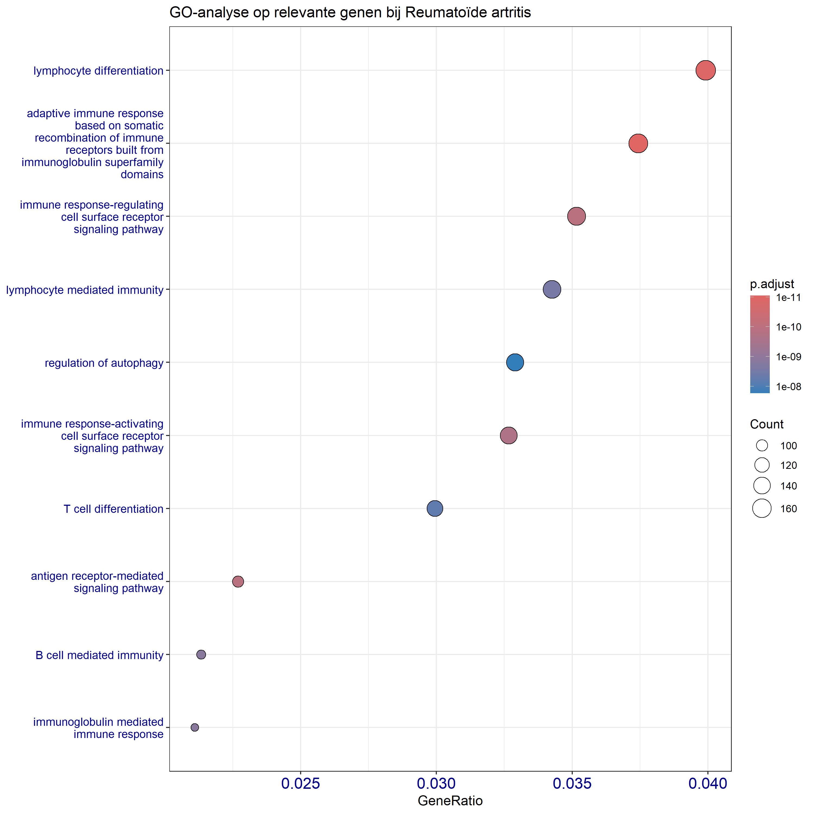
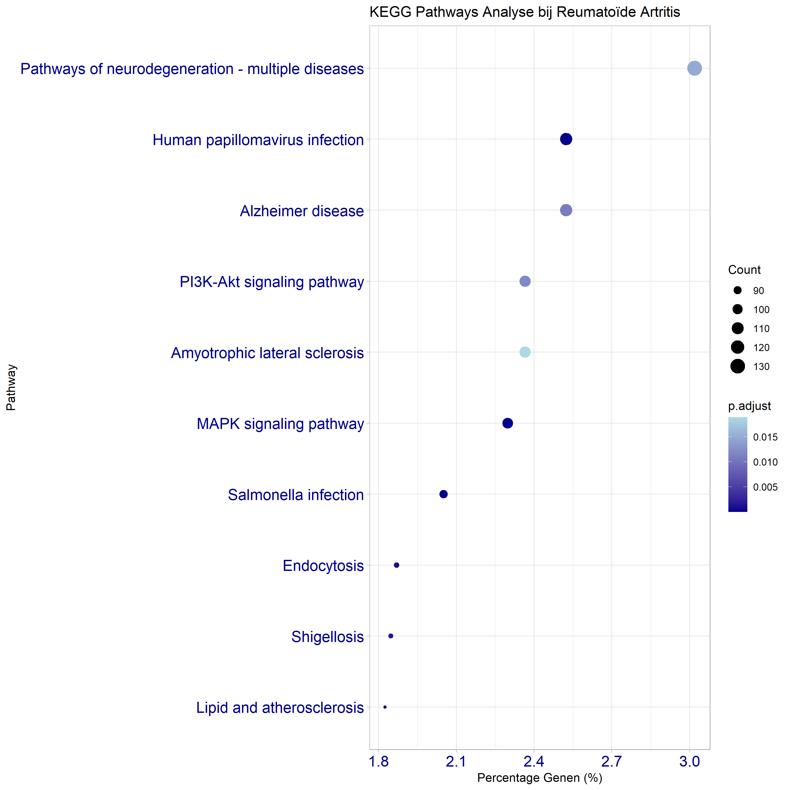
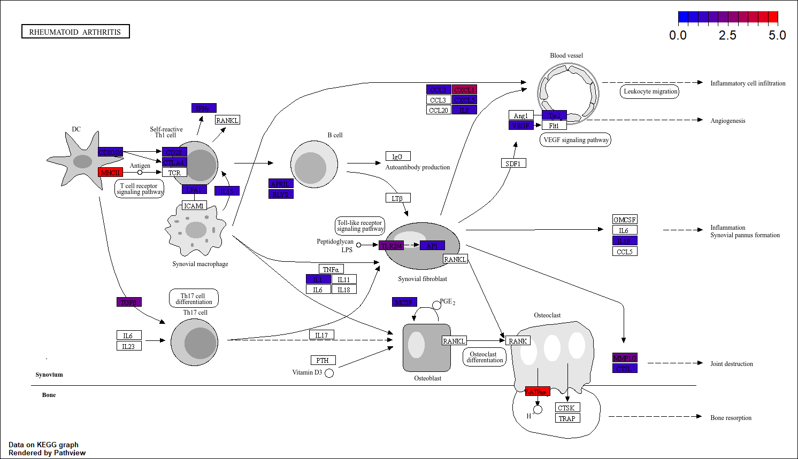

# Significant verschil tussen genexpressie van mensen met reumatoïde artritis en gezonde mensen
Niels Hoitsma - nielshoitsma1@student.nhlstenden.com - laatste bewerking: 29-5-2026
## Inleiding
Reumatoïde artritis (RA) is een chronische ziekte waarbij het immuunsysteem het synovium (ook wel bekend als het gewrichtsslijmvlies) van een mens als het ware aanvalt. Hierdoor kan ontsteking van gewrichtsslijmvlies ontstaan, afbraak van kraakbeen plaatsvinden en vorming van abnormaal weefsel, ook wel pannus genoemd [[1]](https://pmc.ncbi.nlm.nih.gov/articles/PMC8780115/pdf/ijms-23-00905.pdf). Hierdoor kunnen patienten last krijgen van pijn, zwellingen, of stijfheid. Belangrijke oorzaken van RA zijn erfelijkheid, omgevingsfactoren zoals roken, en immuunactivatie. Momenteel is er helaas nog geen goed werkend medicijn. Er zijn verschillende medicijnen beschikbaar, maar niet alle patienten reageren daar goed op. Door het gebrek aan een goed werkend medicijn is er behoefte naar onderzoek naar reuma [[2]](https://core.ac.uk/reader/77600864?utm_source=linkout).
### Onderzoeksdoel
In dit onderzoek wordt met behulp van transcriptomics het verschil in genexpressie bij patiënten met RA en gezonde mensen onderzocht. Ook wordt gekeken naar de biologische processen en pathways waar genen die verschillen in genexpressie bij betrokken zijn. Daarnaast wordt het verschil in genexpressie op de [Rheumatoid arthritis pathway](https://www.kegg.jp/entry/map05323) geprojecteerd. De acht verkregen samples worden met het humane genoom vergeleken in Rstudio.

## Materiaal en Methode
Om te kunnen onderzoeken welke genen meer tot expressie komen bij mensen die ziek zijn met reuma dan bij mensen die gezond zijn worden de data geanalyseerd van 4 gezonde mensen, en 4 mensen die besmet zijn met reuma. De data is afkomstig vanuit het synoviumbiopt: weefsel afkomstig in gewrichtsslijmvlies. Personen met RA zijn positief getest op ACPA, personen zonder RA negatief. Van de zieke mensen is het minimaal twaalf maanden bekend dat de mensen ziek zien met RA. De gebruikte data is te vinden onder ["Data>RawData"](https://github.com/NielsHoi/26-5-Casus_Transcriptomics-/tree/main/Data/RawData). 

De data is uitgelijnd tegen het [referentiegenoom GRCh38.p14](https://www.ncbi.nlm.nih.gov/datasets/genome/GCF_000001405.40/) in Rstudio (Versie 2026.01.0+392) met behulp van Rsubread (Versie 2.24.0) om vervolgens voor elke sample [BAM-files](https://github.com/NielsHoi/26-5-Casus_Transcriptomics-/tree/main/Data/ProcessedData) te maken. Vervolgens wordt met de verkregen data een [count matrix](https://github.com/NielsHoi/26-5-Casus_Transcriptomics-/tree/main/Data/ProcessedData) gemaakt.

Nadat de count matrix gemaakt is, kan vervolgens een statistische analyse gedaan worden met behulp van pakket DESeq2 (Versie 1.50.2) waarbij de genexpressie van de mensen met RA vergeleken kan worden met de gezonde mensen, hierbij worden genen met een P-waarde lager dan 0,05 beschouwd als statistisch significant verschillend. De genexpressie van verschillende genen kan dan worden uitgebeeld in een volcanoplot met behulp van de functie EnhancedVolcano (Versie 1.28.2).

Vervolgens wordt een gene ontology-analyse (GO-analyse) en een KEGG-pathway-analyse om zicht te krijgen op welke genen belangrijk zijn in verrschillende metabolic pathways. Het volledige script wat gebruikt wordt in Rstudio is te vinden bij ["Script"](https://github.com/NielsHoi/26-5-Casus_Transcriptomics-/tree/main/Script).

*Flowchart voor de analyse van  *

## Resultaten
Om te onderzoeken of er verschil zit tussen genexpressie bij mensen met RA en gezonde mensen is een volcano plot gemaakt. In figuur 2 is de volcano plot van de differentiële genexpressieanalyse tussen de onderzochte groepen te vinden. In totaal werden 29.407 genen geanalyseerd. De x-as geeft de log₂ fold change weer, terwijl de y-as de statistische significantie weergeeft als −log₁₀(p-waarde). Zowel opgereguleerde als neergereguleerde genen laten een significante verschil in expressie zien tussen monsters afkomstig van mensen met RA en de controlegroep. Genen zoals ANKRD30BL, MT-ND6, SLC9A3R2 en ZNF598 komen meer tot expressie bij mensen met RA, en genen als IGHV3-53, IGHV1-69 en IGHG4 komen juist minderr tot expressie.

  

  Figuur 2. Volcano plot van de differentiële genexpressieanalyse tussen patiënten met RA en gezonde controles. De x-as toont de log₂ fold change en de y-as de −log₁₀(p-waarde).

Om inzicht te krijgen in biologische processen die geassocieerd zijn met de geëxpresseerde genen bij RA is een GO-analyse uitgevoerd. In figuur 3 is te zien dat vooral biologische processen die te maken hebben met het immuunsysteem, zoals lymfocytdifferentiatie, lymfocyt-gemedieerde immuniteit, T-celdifferentiatie en B-celgemedieerde immuniteit, geassocieerd worden met de geëxpresseerde genen. 

  

 Figuur 3. Resultaat van GO-analyse van de differentieel geëxpresseerde genen bij reumatoïde artritis. De x-as toont de GeneRatio, wat de verhouding weergeeft tussen het aantal genen in een GO-term en het totaal aantal onderzochte genen. De grootte van de punten geeft het aantal genen binnen een biologische procescategorie weer, terwijl de kleur de aangepaste p-waarde (p.adjust) representeert.

Daarnaast is een KEGG-analyse uitgevoerd om inzicht te krijgen welke pathways betrokken zijn bij RA. Uit de KEGG-way analyse, te vinden in figuur 4, blijkt dat de hoogste verrijking werd waargenomen voor "Pathways of neurodegeneration – multiple diseases", gevolgd door onder andere de PI3K-Akt signaling pathway en de MAPK signaling pathway. Ook werden verrijkingen gevonden voor pathways gerelateerd aan infectieprocessen, zoals Human papillomavirus infection, Salmonella infection en Shigellosis. Daarnaast werden pathways betrokken bij endocytose en lipid and atherosclerosis ook geïdentificeerd.

  

 Figuur 4. Resultaat van de KEGG-pathway analyse van geëxpresseerde genen bij RA. De x-as toont het percentage genen dat betrokken is bij een pathway. De grootte van de punten geeft het aantal genen binnen een pathway weer, terwijl de kleur de aangepaste p-waarde (p.adjust) representeert.

Om te onderzoeken welke genen effect hebben op de [Rheumatoid arthritis pathway](https://www.kegg.jp/entry/map05323) is een analyse gedaan waarbij de geëxpresseerrde genen werden geprojecteerd op de pathway. Hierbij werden meerdere genen geïdentificeerd die betrokken zijn bij immuunactivatie, ontstekingsprocessen en gewrichtsschade, zie figuur 5. Verschillende genen die betrokken zijn bij T-celactivatie en cytokinesignalering, waaronder CD28, CTLA4, IL15, IL1B en TLR24, vertoonden veranderde expressieniveaus. Daarnaast werden veranderingen waargenomen in genen die betrokken zijn bij angiogenese, zoals VEGFC en Tie2, en in genen die een rol spelen bij gewrichtsdestructie, zoals MMP13 en CTSL. 

  

 Figuur 5. Pathway-analyse op de [Rheumatoid arthritis pathway](https://www.kegg.jp/entry/map05323). Hierbij zijn genen die een veranderde expressie hebben ten opzichte van gezonde mensen met een kleur aangegeven. 

## Conclusie
In deze studie werd onderzocht welke genen en biologische processen verschillen tussen patiënten met reumatoïde artritis (RA) en gezonde controles. De genexpressie, weergegeven in een volcano plot, liet zien dat er statistisch significant verschil in genexpressie is. Onder de meest opvallende genen bevonden zich onder andere ANKRD30BL, MT-ND6, SLC9A3R2, ZNF598, IGHV3-53, IGHV1-69 en IGHG4. 

Uit de GO-analyse bleek dat de geëxpresseerde genen voornamelijk voorkwamen bij processen die te maken hebben met immunologische processen. Met name de biologische processen lymfocytdifferentiatie, adaptieve immuunrespons, T-celdifferentiatie, B-celgemedieerde immuniteit en lymfocyt-gemedieerde immuniteit waren significant verrijkt. Dit wijst erop dat verandering in de regulatie en activatie van immuuncellen bij mensen met RA een belangrijke rol speelt. De KEGG-pathway analyse identificeerde meerdere verrijkte signaalroutes, waaronder de PI3K-Akt signaling pathway en de MAPK signaling pathway. Deze routes zijn betrokken bij celactivatie, proliferatie en ontstekingsreacties [[3]](https://www.nature.com/articles/s41392-021-00828-5). 

Projectie van de expressiegegevens op de KEGG rheumatoid arthritis pathway liet zien dat verschillende genen betrokken zijn bij immuunactivatie, cytokinesignalering, angiogenese en gewrichtsdestructie. Dit ondersteunt het huidige inzicht dat RA wordt gekenmerkt door een ontregelde immuunrespons die leidt tot chronische ontsteking en progressieve beschadiging van gewrichten.

De resultaten laten zien dat er statistisch significant verschil in genexpressie is gevonden tussen mensen met RA en gezonde mensen. Ook is gevonden dat de differentiële genexpressie effect heeft op verrschillende biologische processen en pathways die invloed hebben op immuunrespons, productie van immuuncellen, onstekingsreacties en gewrichtdestructie. Dit ondersteunt het huidige inzicht op de klachten die mensen met RA kunnen ervaren.

## Bronnen, AI en Github
### Bronnen
Voor het verslag zijn de volgende bronnen gebruikt:
[[1]](https://pmc.ncbi.nlm.nih.gov/articles/PMC8780115/pdf/ijms-23-00905.pdf) Jang, S., Kwon, E. J., & Lee, J. J. (2022) Rheumatoid Arthritis: Pathogenic Roles of Diverse Immune Cells. In International Journal of Molecular Sciences (Vol. 23, Number 2). MDPI. https://doi.org/10.3390/ijms23020905

[[2]](https://core.ac.uk/reader/77600864?utm_source=linkout) Author, C., Smolen, J. S., Author, F., Smolen Order of Authors, J. S., Aletaha, D., McInnes, I., & Smolen, J. (n.d.). Elsevier Editorial System(tm) for The Lancet Manuscript Draft Manuscript Number: Title: Rheumatoid Arthritis Article Type: Invited Seminar Seminar: Rheumatoid Arthritis.

[[3]](https://www.nature.com/articles/s41392-021-00828-5) He, Y., Sun, M. M., Zhang, G. G., Yang, J., Chen, K. S., Xu, W. W., & Li, B. (2021). Targeting PI3K/Akt signal transduction for cancer therapy. In Signal Transduction and Targeted Therapy (Vol. 6, Number 1). Springer Nature. https://doi.org/10.1038/s41392-021-00828-5

### AI-gebruik
AI is gebruikt om te helpen met spelling, het helpen beginnen met informatie opzoeken, en met het uitleggen van errors in Rstudio.
